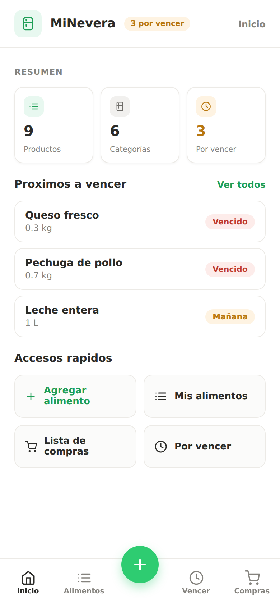
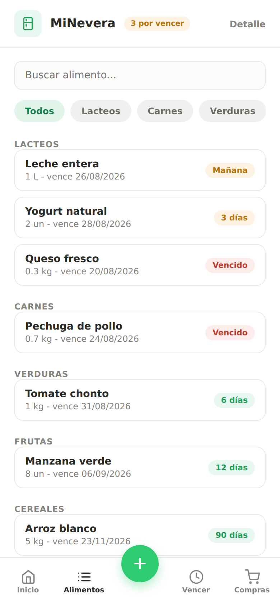
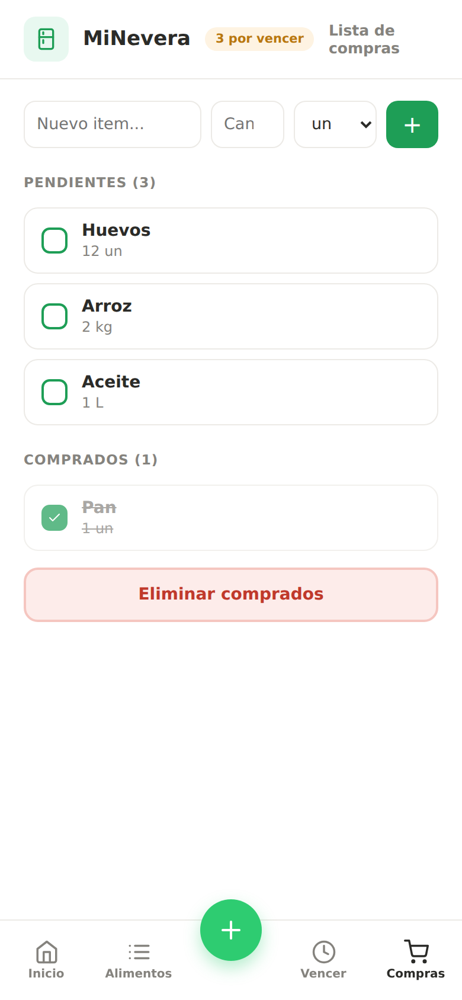

# MiNevera 🥬

App híbrida para gestionar los alimentos del hogar: inventario, alertas de vencimiento y lista de compras. **Funciona 100% sin internet.**

- **Repositorio:** https://github.com/Zteve0/AppHibridaEntrga2
- **Prototipo (Figma):** https://www.figma.com/design/zDGVfp74RDr4VcFCuuM7we/Wireframe-App-Alimentos?node-id=0-1&t=9W2ChC2TUd94zbPV-1
- **Equipo:** Steve Ellis · Juan Andrés Zhero · Integrante 3

## Ejecución del proyecto

Requisitos: Node.js 18+ y npm.

```bash
npm install      # instala dependencias (solo la primera vez)
npm run dev      # servidor de desarrollo en http://localhost:5173
npm run build    # genera el bundle final minificado en dist/
npm run preview  # sirve dist/ en local para probar el build
```

El build de `dist/` usa rutas relativas y `HashRouter`, así que funciona en cualquier carpeta local sin servidor ni conexión — es el bundle que se usará para crear el instalador.

## Capturas

| Inicio | Alimentos | Lista de compras |
| --- | --- | --- |
|  |  |  |

Capturas tomadas del build de produccion (`npm run build`) en viewport movil de 390x844.

## Stack

| Capa | Herramienta |
| --- | --- |
| SPA | React 18 + React Router (HashRouter) |
| Bundler | Vite — compila SASS, minifica CSS/JS e incrusta los assets en el bundle |
| Estilos | SASS con parciales (`_variables`, `_base`, `_layout`, `_components`, `_forms`) |
| Datos | `localStorage` (claves `minevera_alimentos` y `minevera_compras`) — sin backend ni internet |

## Estructura

```
minevera-app/
├── index.html            # único html (SPA)
├── vite.config.js        # base './', assets incrustados, minificación
└── src/
    ├── main.jsx          # punto de entrada
    ├── App.jsx           # rutas (react-router)
    ├── context/          # estado global + persistencia localStorage
    ├── pages/            # Inicio, Alimentos, Agregar/Editar, Detalle, Vencer, Compras
    ├── components/       # NavBar, TabBar, ItemAlimento, Iconos
    ├── data/             # datos semilla
    ├── utils/            # fechas y categorías
    └── styles/           # main.scss + parciales SASS
```

## Diseño

- Paleta de tonos neutros (coolors.co) con **verde #2ECC71** como color distintivo de la acción principal.
- Navegación coherente: barra superior con nombre e ícono de la app, tab bar inferior fija con 5 accesos y botón central destacado.
- Tipografía: para usar Google Fonts sin internet, descarga **Archivo** (fonts.google.com), pon los `.woff2` en `src/assets/fonts/` y decláralos con `@font-face` en `_base.scss`; ya está como primera opción de la pila tipográfica.

## Decisiones técnicas

- **HashRouter** en vez de BrowserRouter: la navegación funciona sin servidor, incluso abriendo `dist/index.html` directamente — clave para el requisito offline.
- **localStorage** como única fuente de datos: sin backend, la app arranca con datos semilla la primera vez.
- **Inventario ordenado alfabéticamente** al agregar/editar, y alertas por umbral de 3 días (`DIAS_ALERTA`).
- **Colores suaves**: superficies blancas, bordes #ECEAE6, chips y métricas con tintes claros; el verde queda solo para acciones y estados positivos.

## Notas de la entrega

- Ver `COMMITS.md` para el plan de trabajo por integrante (ramas y commits).
- `.gitignore` excluye `node_modules/` y `dist/`.
